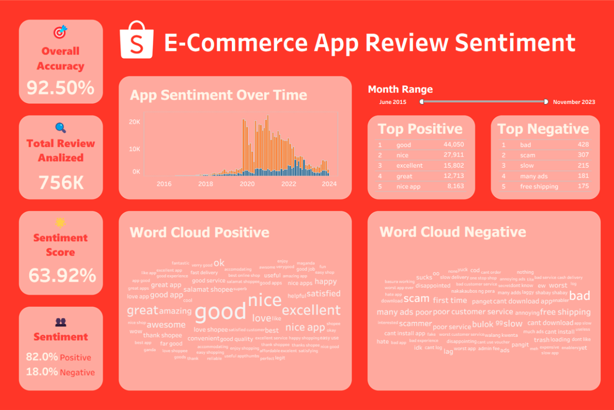

# 🛒 E-Commerce App Review Sentiment Analysis
<div align="justify">
An end to end NLP project that analyzes over 750,000 customer reviews from an e-commerce app to extract sentiment insights and visualize patterns using interactive dashboards.

## 📊 Interactive Dashboard Preview



**🔗 [View the Interactive Dashboard on Tableau Public]([https://public.tableau.com/app/profile/your-link](https://public.tableau.com/views/e-CommerceAppReviewsSentimentTrendsWordInsights/Dashboard1?:language=en-GB&:sid=&:redirect=auth&:display_count=n&:origin=viz_share_link))**

---

## 📌 Project Overview

In the fast growing digital marketplace, customer feedback offers invaluable insight. But with hundreds of thousands of app reviews, manually understanding sentiment is nearly impossible. 

This project leverages machine learning and natural language processing to classify reviews and present actionable insights through a Tableau dashboard.

---

## ❓ Business Questions

- What is the **overall customer sentiment** toward the product?
- How has sentiment **changed over time**?
- What are the **top positive and negative keywords**?
- Can we monitor customer sentiment by **month or period**?
- What percentage of users are **unhappy** with their experience?

---

## ✅ Solution Summary

A binary sentiment classification model was developed using Logistic Regression. Reviews rated 1-2 stars were labeled **Negative**, and 4–5 stars were labeled **Positive**. Neutral (3-star) reviews were excluded to improve model performance.

### 📊 Model Performance (on Unseen Test Data):

| Metric                 | Score | Business Impact                                        |
|------------------------|:-----:|--------------------------------------------------------|
| **Recall (Negative)**  | 86%   | Captures majority of unhappy users for intervention   |
| **Precision (Negative)**   | 69%   | Correctly flags dissatisfied reviews                  |
| **Accuracy (Overall)**     | 83%   | High reliability in predicting sentiments             |

---

## 🔍 Key Insights (from Dashboard)

- **Create a "Pain Point" Dashboard:** By isolating the reviews correctly identified as "Negative" and visualizing their most common keywords (e.g., with a Word Cloud in Tableau), the product team can get a near real time report of the biggest customer complaints (e.g., "slow," "many ads," "scam").
- **Identify "Praise Points":** A similar analysis on "Positive" reviews can highlight what features the marketing team should emphasize in their campaigns (e.g., "easy," "fast," "nice app").
- **Show "Average Sentiment Score":** Tracked monthly to measure customer satisfaction

> Explore these insights visually in the Tableau dashboard:  
> 📈 **[View Dashboard](https://public.tableau.com/views/e-CommerceAppReviewsSentimentTrendsWordInsights/Dashboard1?:language=en-GB&:sid=&:redirect=auth&:display_count=n&:origin=viz_share_link)**

---

## 🧪 Workflow & Methodology

1. **Data Loading & Labeling**  
   Cleaned ~780,000 Shopee reviews, labeled sentiment based on ratings.
2. **Text Preprocessing**  
   Lowercased, removed punctuation, stopwords, and numeric noise.
3. **Vectorization**  
   Used `TfidfVectorizer` with top 5,000 most relevant terms.
4. **Model Training**  
   Logistic Regression with `class_weight='balanced'`.
5. **Evaluation & Export**  
   Confusion matrix, classification report, and prediction exports.

---

## 🛠️ Tech Stack

| Category        | Tools/Frameworks                       |
|----------------|----------------------------------------|
| Language        | Python                                 |
| Libraries       | Pandas, Scikit-learn, NLTK, Matplotlib, Seaborn |
| Environment     | Jupyter Notebook / Google Colab        |
| Visualization   | Tableau Public                         |
| Model           | Logistic Regression (TF-IDF Features)  |

---
</div>

## 📁 Project Structure

```bash
├── data/
│   └── SHOPEE_REVIEWS.csv
├── notebooks
│   └── sentiment_analysis.py
│   └── sentiment_analysis.ipynb
├── results/
│   └── sentiment_analysis_results.csv
│   └── visualizations/
│       ├── dashboard_preview.png
│       ├── sentiment_distribution.png
│       └── confusion_matrix.png
└── README.md
